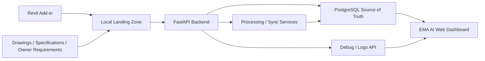
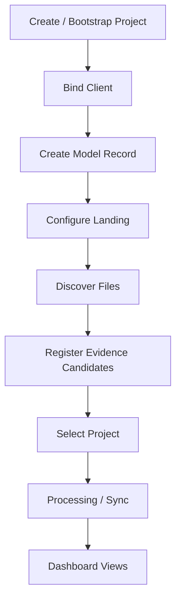
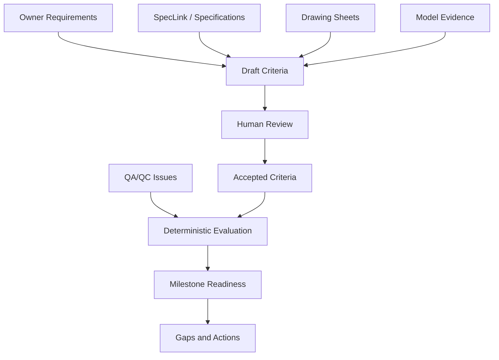
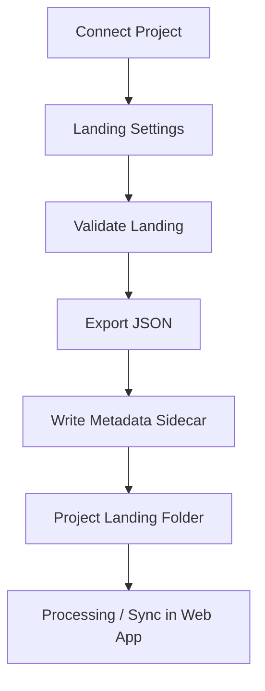
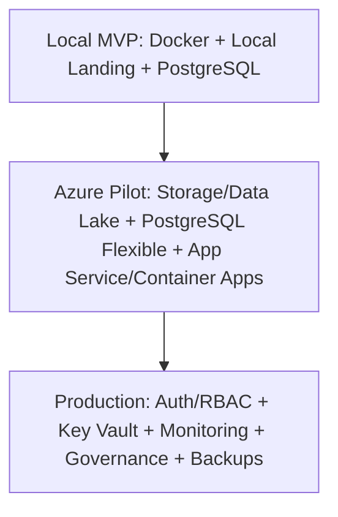

# Architecture Mermaid Diagrams

## Overall System Architecture

## Local Project Setup Flow

## Milestone Criteria Architecture

## Revit Add-in Workflow

## Local / Azure / Production Evolution

