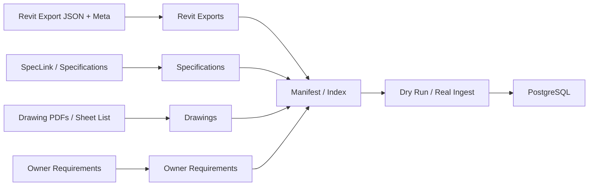
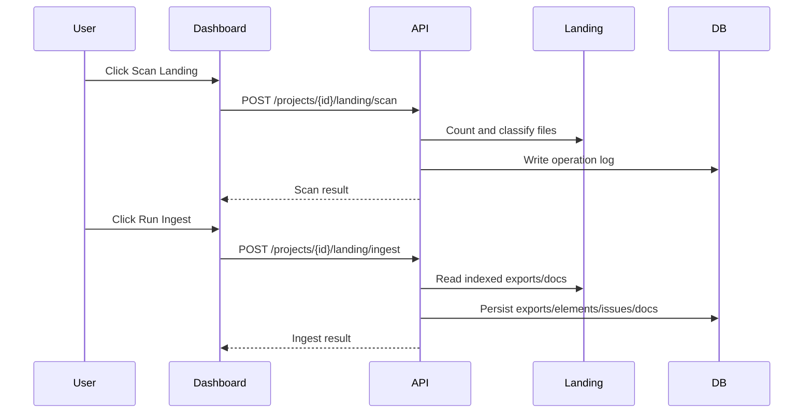
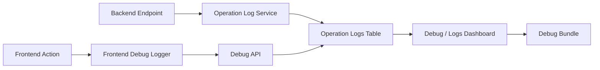

# Data Flow Mermaid Diagrams

## Landing Zone Data Flow

```mermaid
flowchart LR
  Revit["Revit Export JSON + Meta"] --> RevitExports["Revit Exports"]
  Specs["SpecLink / Specifications"] --> Specifications
  Sheets["Drawing PDFs / Sheet List"] --> Drawings
  Owners["Owner Requirements"] --> OwnerReqs["Owner Requirements"]
  RevitExports --> Manifest["Manifest / Index"]
  Specifications --> Manifest
  Drawings --> Manifest
  OwnerReqs --> Manifest
  Manifest --> Ingest["Dry Run / Real Ingest"]
  Ingest --> DB["PostgreSQL"]
```

## Processing / Sync Flow

```mermaid
sequenceDiagram
  participant User
  participant Dashboard
  participant API
  participant Landing
  participant DB
  User->>Dashboard: Click Scan Landing
  Dashboard->>API: POST /projects/{id}/landing/scan
  API->>Landing: Count and classify files
  API->>DB: Write operation log
  API-->>Dashboard: Scan result
  User->>Dashboard: Click Run Ingest
  Dashboard->>API: POST /projects/{id}/landing/ingest
  API->>Landing: Read indexed exports/docs
  API->>DB: Persist exports/elements/issues/docs
  API-->>Dashboard: Ingest result
```

## Debug / Logs Architecture

```mermaid
flowchart LR
  FrontendAction["Frontend Action"] --> DebugClient["Frontend Debug Logger"]
  DebugClient --> DebugAPI["Debug API"]
  BackendEndpoint["Backend Endpoint"] --> OpLog["Operation Log Service"]
  OpLog --> DB["Operation Logs Table"]
  DebugAPI --> DB
  DB --> DebugPage["Debug / Logs Dashboard"]
  DebugPage --> Bundle["Debug Bundle"]
```
