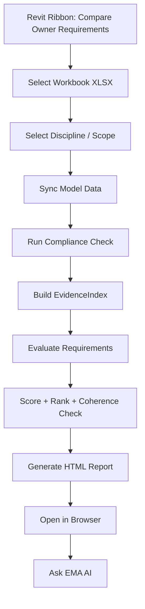
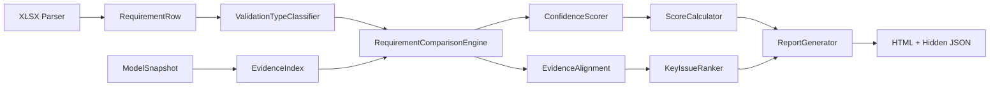
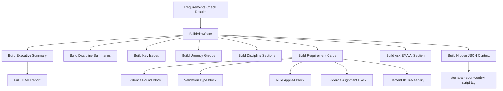
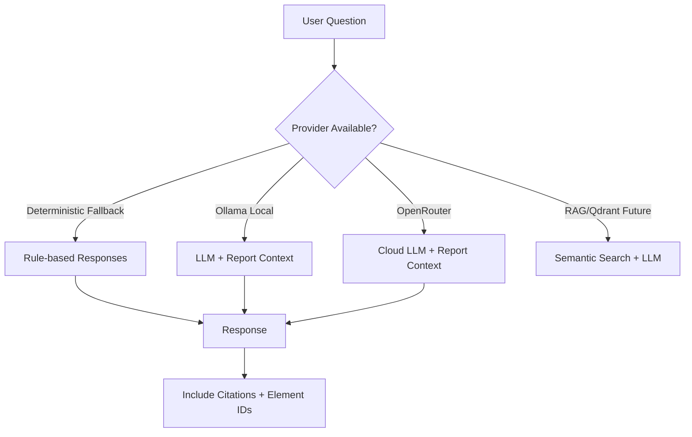

# EMA AI — System Architecture

**Last updated:** 2026-06-08

---

## System Overview

EMA AI is a Revit-first Owner Requirements Readiness platform. The deterministic engine in the Revit add-in is the core system; the backend and dashboard are optional intelligence layers.

```
┌────────────────────────────────────────────────────────────────┐
│                    Revit Add-in (C# .NET 4.8)                   │
│  ┌─────────────┐  ┌──────────────┐  ┌───────────────────────┐  │
│  │ Load        │  │ Sync Model   │  │ Run Compliance Check  │  │
│  │ Requirements│  │ Data         │  │ (Deterministic Engine)│  │
│  └─────────────┘  └──────────────┘  └───────────────────────┘  │
│                                           │                    │
│                                           ▼                    │
│                              ┌──────────────────────┐          │
│                              │  HTML Report Generator│          │
│                              │  + Hidden JSON Context│          │
│                              └──────────────────────┘          │
└────────────────────────────────────────────────────────────────┘
                              │
                              ▼
              ┌──────────────────────────────┐
              │   Local Landing Zone (FS)     │
              │  Revit Exports / Requirements │
              └──────────────────────────────┘
                              │
                              ▼
              ┌──────────────────────────────┐
              │   FastAPI Backend (Optional)  │
              │   PostgreSQL + Readiness      │
              └──────────────────────────────┘
                              │
                              ▼
              ┌──────────────────────────────┐
              │   React Dashboard (Optional)  │
              └──────────────────────────────┘
```

---

## Revit Add-in Architecture

### Components
- **Ribbon:** "Compare Owner Requirements" and "Open EMA AI Panel" in EMA AI tab
- **WPF Panel:** Modeless operational dashboard with Overview, Requirements, Readiness, Issues, Exports, Settings
- **Modal Dialog:** Workbook/discipline/scope/output folder selection
- **Excel Parser:** Reads `.xlsx` / `.xlsm` requirements workbooks
- **Model Snapshot Service:** Captures current Revit model elements
- **Deterministic Engine:** `RequirementComparisonEngine`, `ValidationTypeClassifier`, `ConfidenceScorer`, `ScoreCalculator`, `KeyIssueRanker`
- **EvidenceIndex:** Pre-built O(1) category lookup for element matching
- **Report Generator:** `OwnerRequirementHtmlReportGenerator` — self-contained HTML with CSS/JS + hidden JSON
- **Local Settings:** Last report path and summary persisted

### Workflow


---

## Deterministic Engine Architecture



### Engine Components

| Component | File | Purpose |
|-----------|------|---------|
| ValidationTypeClassifier | `EMAExtractor/Requirements/ValidationTypeClassifier.cs` | Classifies requirement as Model/Drawing/Spec/Manual/Hybrid |
| RequirementComparisonEngine | `EMAExtractor/Requirements/RequirementComparisonEngine.cs` | Evidence matching, rule dispatch, status assignment, semantic guardrails |
| ConfidenceScorer | `EMAExtractor/Requirements/ConfidenceScorer.cs` | 6-factor confidence calculation |
| ScoreCalculator | `EMAExtractor/Requirements/ScoreCalculator.cs` | Overall, discipline, readiness scores |
| KeyIssueRanker | `EMAExtractor/Requirements/KeyIssueRanker.cs` | 6-factor key issue ranking with severity |
| RequirementCheckModels | `EMAExtractor/Requirements/RequirementCheckModels.cs` | Core data models (status, evidence, alignment, results) |

---

## Report Generation Architecture



### Report Layers

**Human-readable layer (visible HTML):**
- Executive Summary with metric cards
- Discipline Allocation with scores
- Status/Urgency Legends
- Key Issues with reasoning and actions
- Requirement-by-requirement detail
- Evidence Found, Validation Type, Rule Applied
- Evidence Alignment, Reasoning, Next Best Action
- Revit Element ID traceability (collapsed by default)
- Ask EMA AI section with suggested questions

**Machine-readable layer (hidden JSON):**
- `<script type="application/json" id="ema-ai-report-context">`
- Metadata: project, dates, version, data hash
- Summary counts: total, met, not met, needs review, insufficient, NA
- Key issues list with scores and disciplines
- Requirement results array with full evidence
- Element IDs for every match
- `ai_lookup_hints`, `anchors`, and traceability

---

## Ask EMA AI Architecture



### Provider Chain
1. **Deterministic Fallback** (required, always available)
2. **Ollama Local** (preferred, default: qwen3.6:35b)
3. **OpenRouter** (optional, if API key configured)
4. **RAG/Qdrant** (future, not yet implemented)

### Guardrails
- AI explains only from report context
- AI must not certify, approve, change statuses, invent evidence
- Citations and Element IDs required
- If context insufficient, say so

---

## Backend/Frontend Role (Optional)

The FastAPI backend + PostgreSQL + React dashboard are **optional intelligence layers**. They are not required for the designer Revit workflow.

- **Backend** provides landing discovery, ingestion, readiness scoring, document management
- **Dashboard** provides portfolio view, cross-project analysis, historical trends
- Both are **advisory/management** tools, not the primary workflow

---

## Local/Cloud Profiles

| Layer | Local (Current) | Cloud (Planned) |
|-------|----------------|-----------------|
| Revit Add-in | Revit 2023/2024/2025/2026/2027 | Same |
| Report | Self-contained HTML | Same |
| Backend | Docker Compose FastAPI + PostgreSQL | Azure Container Apps + PostgreSQL Flexible |
| Frontend | Vite dev server | Azure Static Web Apps |
| AI | Ollama local (qwen3.6:35b) | OpenRouter, future RAG |
| Storage | Local filesystem | ADLS Gen2 |

---

## Failure Modes

| Failure | Behavior | Mitigation |
|---------|----------|------------|
| No Excel parser available | Dialog error | Validate workbook before loading |
| No Revit elements loaded | Compliance check fails | Guide user to sync model data first |
| LLM unavailable | Deterministic fallback | Provider chain always degrades gracefully |
| Report generation fails | Error dialog with message | Log exception, suggest retry |
| Element IDs overflow UI | Collapsed by default | Expand/collapse toggle with preview |

---

## Security / Secrets

- No secrets in documentation or logs
- AI provider keys from environment variables only
- Real client files never committed
- Local demo users not production authentication

---

## Future Extensions

- Backend sync of requirement check runs (opt-in)
- PDF export enhancement
- RAG/Qdrant for semantic evidence retrieval
- ACC/integration for cloud landing
- APS model viewer integration
