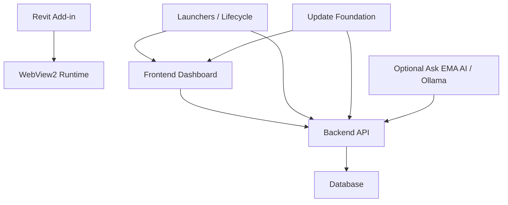

# EMA AI Component Matrix

This matrix defines the installer/release foundation selected for EMA AI.
The current implementation is intentionally conservative: deterministic core
components are installable first, and optional dependencies remain optional.

## Install Profiles

| Profile | Components | Default Purpose |
|---|---|---|
| `revit-only` | Revit Add-in | Designer workflow in Revit only |
| `pilot-core` | Revit Add-in, Backend API, Database, Frontend Dashboard, Launchers, Update Foundation | Full pilot bundle without local AI |
| `pilot-plus-local-ai` | Pilot Core, Optional Ask EMA AI / Ollama | Adds advisory local AI support when available |

## Components

| Component | Package | Depends On | Prerequisites | Install Target | Data Retention | Notes |
|---|---|---|---|---|---|---|
| Revit Add-in | `installer/release/ema-ai.components.json` | None | Installed Revit year, WebView2 runtime recommended | `%APPDATA%\Autodesk\Revit\Addins\<year>` | User settings preserved | Deterministic checker and Revit UI entrypoint |
| Backend API | `Pipeline/pipeline` release files | Database | Docker Desktop | `%LOCALAPPDATA%\EMA AI\backend` | Keep Docker volume by default | FastAPI + deterministic backend stack |
| Database | `Pipeline/pipeline/db` release files | None | Docker Desktop | Docker named volume | Keep volume by default | PostgreSQL remains official source of truth |
| Frontend Dashboard | `Pipeline/pipeline/frontend/dist` | Backend API | Browser; no Node runtime required | `%LOCALAPPDATA%\EMA AI\frontend` | No persistent app data required | Static production build served without a dev server |
| Launchers / Lifecycle | Release scripts | Backend API, Frontend Dashboard | PowerShell 5.1+ | `%LOCALAPPDATA%\EMA AI\scripts` | No persistent app data required | Start, stop, health, repair, uninstall, rollback staging |
| Update Foundation | Release scripts | Backend API, Frontend Dashboard | PowerShell 5.1+ | `%LOCALAPPDATA%\EMA AI\scripts` | No persistent app data required | Manifest verification, anti-downgrade, last-known-good staging |
| Optional Ask EMA AI / Ollama | Optional component | Backend API | Local Ollama runtime if enabled | Host-controlled | User-managed | Advisory only, never required for deterministic operation |

## Component Dependencies

## Release Expectations

- The installer should refuse to start a profile that requires Docker when Docker is missing.
- The installer should warn when Revit is running and keep installation reversible.
- Database data should survive uninstall by default.
- Local AI must remain optional and must not block deterministic operation.
- The release bundle should carry hashes and provenance for all shipped artifacts.
